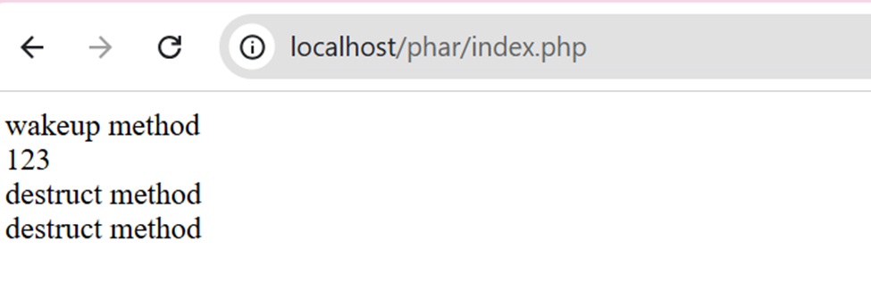

# PHP PHAR DESERIALIZATION DEMO

## 1. Tổng quan về lỗ hổng

**PHP PHAR Deserialization** là một lỗ hổng bảo mật nguy hiểm xuất hiện khi ứng dụng PHP xử lý file PHAR (PHP Archive) mà không kiểm soát đúng cách quá trình **giải tuần tự (unserialize)** dữ liệu chứa trong **metadata (siêu dữ liệu)** của file.
### Điều kiện khai thác lỗ hổng
1. Tìm được POP chain trong trong source code cần khai thác
2. Đưa được Phar file vào đối tượng cần khai thác
3. Tìm được entry point, đó là những chỗ mà các filesystem function gọi tới các Phar file do người dùng kiểm soát

## 2. Một số khái niệm
### 2.1. Deserialization
**Serialization** là quá trình xử lý, chuyển đổi các thuộc tính của một đối tượng thành một định dạng dữ liệu ví dụ như binary fomat, từ đó có thể lưu trên ổ đĩa, hoặc sử dụng vào các mục đích cần thiết khác, còn quá trình **Deserialization** là quá trình ngược lại.

Lỗ hổng Deserialization trong PHP hay còn gọi là PHP Object Injection, có thể giúp kẻ tấn công thực hiện nhiều loại tấn công khác nhau như:  [Code Injection](https://owasp.org/www-community/attacks/Code_Injection), [SQL Injection](https://owasp.org/www-community/attacks/SQL_Injection), [DoS](https://wiki.owasp.org/index.php/Application_Denial_of_Service),… tùy vào từng trường hợp cụ thể.

Để thực hiện khai thác thành công lỗ hổng này trên nền tảng PHP ta cần 2 điều kiện sau:

1. Đối tượng cần sử dung Magic method.
2. Tìm được POP chain, hay chính là có thể tùy chỉnh được các đoạn code trong quá trình hàm `unserialize()` được gọi.

### 2.2. Magic method
Magic method là các function đặc biệt trong các lớp của PHP, tên của các function này có hai dấu gạch dưới đứng trước, nó sẽ được gọi ngầm ở một sự kiện cụ thể, ví dụ như: `__sleep()`, `__toString()`, `__construct()`, …. Phần lớn trong số các function này sẽ không làm gì nếu không có sự khai báo, thiết lập của người lập trình. 
1. `__wakeup()`: Được gọi khi một đối tượng được deserialize.
2. `__destruct()`: Được gọi khi một kịch bản PHP kết thúc hoặc một đối tượng không còn được dùng trong code nữa và bị hủy bỏ.
3. `__construct()`: Được gọi khi một đối tượng được khởi tạo.
4. `__toString()`: Được gọi khi một đối tượng được gọi như một chuỗi.

**Ví dụ về magic method**
```php
<?php
class Test{
    public function __destruct() {
        echo 'destruct method </br>';
    }
    public function __wakeup() {
        echo 'wakeup method </br>';
    }
}

$test = new Test();
$serialize = $serialize($test);
$unserialize = $unserialize($serialize);
echo '123 </br>';
```


Đoạn code cho thấy function `__wakeup()` đã được gọi tới ngay sau khi đối tượng thuộc lớp **Test** được deserialize và khi kết thúc kịch bản PHP trên thì function `__destruct()` cũng ngay lập tức được gọi ngầm.

## 2.3. POP chain
**POP chain** (viết tắt của **Property-Oriented Programming chain**) là một chuỗi các **phương thức (methods)** được **kết nối tự động khi unserialize một đối tượng** trong lập trình hướng đối tượng, thường dùng để **khai thác lỗ hổng Insecure Deserialization** trong các ngôn ngữ như PHP, Java...

**Ví dụ về POP chain**
```php
<?php
class Logger{
    protected $writer;
    public function __construct($writer)
    {
        $this->writer = $writer;
    }

    public function __destruct(){
        $this->writer->shutdown();
    }
}

class Mail{
    protected $transport;
    public function __construct($transport){
        $this->transport = $transport;
    }

    public function shutdown(){
        $this->transport->send();
    }
}

class Sendmail{
    protected $callable;
    protected $to;
    public function __construct($callable, $to){
        $this->callable = $callable;
        $this->to = $to;
    }

    public function send(){
        call_user_func($this->callable, $this->to);
    }
}

$sendmail = new Sendmail('exec','calc');
$mail = new Mail($sendmail);
$logger = new Logger($mail);
```
Đoạn code trên là một POP chain được tạo bảo 3 gadget có thể dẫn tới RCE được biểu diễn theo sơ đồ sau


- Đầu tiên chèn đối tượng **Mail** vào thuộc tính `$writer`, tại dòng code 6 sẽ gọi đến phương thức `shutdown()` của lớp **Mail**.
- Tương tự chèn đối tượng **Sendmail** vào thuộc tính `$transport`, tại dòng code `$this->transport->send();` sẽ gọi tới phương thức `send()` của lớp **Sendmail**.
- Thay đổi giá trị của 2 thuộc tính `$callable = exec` và `$to = calc`.
- Cuối cùng hàm `call_user_func()` được gọi `call_user_func(“exec”, “calc”)` và ứng dụng Calculator trên Window sẽ được mở lên

Sơ đồ chuỗi khai thác

>Logger->__destruct() ➔ Mail->shutdown() ➔ Sendmail->send() ➔ call_user_func('exec', 'calc')

Attacker sẽ truyền vào được các tham số khác gây nguy hiểm.

# 3. Chi tiết lỗ hổng
## 3.1. Phar file trong PHP
Trong PHP, một **PHAR file (PHP Archive)** là một kiểu file nén đặc biệt dùng để đóng gói toàn bộ ứng dụng PHP (bao gồm code, thư viện, assets...) thành một file duy nhất, tương tự như .jar trong Java hoặc .zip.

Cấu trúc file **Phar** bao gồm
- Stub: đơn giản chỉ là một file PHP và ít nhất phải chứa đoạn code sau: <?php __HALT_COMPILER();
- A manifest (bảng kê khai): miêu tả khái quát nội dung sẽ có trong file
- Nội dung chính của file
- Chữ ký: để kiểm tra tính toàn vẹn (cái này là optional, có hay không cũng được)

Điểm đáng chú ý nhất trong cấu trúc của một Phar file đó là phần _manifest_, theo Manual của PHP thì trong mỗi một Phar file, phần _manifest_ có chứa các thông tin sau:


Nơi sẽ chứa những **Meta-data** đã được **serialize** và nó sẽ được **tự động unserialize** nếu được trigger bởi các **filesystem function** khi gọi đến một Phar thông qua `phar://` stream wrapper.

## 3.2. Filesystem function
Dưới đây là danh sách các filesystem function có thể trigger lỗ hổng này


## 3.3. `phar://` stream wrapper
Là một **stream wrapper** cho phép chúng ta có thể truy cập vào các file bên trong một file phar thông qua các **filesytstem function** như đã mô tả ở trên. Khi sử dụng `phar://`, PHP sẽ tự động đọc và unserialize phần metadata của file Phar, kích hoạt các magic method mà không cần gọi `unserialize()` trong code.

# 4. Khai thác 